# system verilog

## 1. 数据类型

### 1.1 基本数据类型

以下是基本数据类型，可以使用unsigned来将有符号的声明为无符号的。

|名称|位宽|类型|符号性|
|----|----|----|----|
|logic|1|4状态|无符号|
|bit|1|2状态|无符号|
|byte|8|2状态|有符号|
|shortint|16|2状态|有符号|
|int|32|2状态|有符号|
|longint|64|2状态|有符号|
|integer|32|4状态|有符号|
|time|64|4状态|无符号|
|real|双精度|2状态|有符号|

调用isunknown可以在表达式的任意位出现 X 或 Z 时返回1,调用$time,可以返回当前仿真时间。

```verilog
    if(isunknown(xxxx)) 
        $display("%0t",$time);
```

### 1.2 数组

如果访问访问越界地址，会返回默认值，比如，4状态元素会返回未知值x，2状态元素会返回0。wire类型没有驱动时输出高阻态z。如果访问地址索引有未知态，也会返回默认值。

数组元素使用32比特的字为边界，一个数组元素，存放在一个或多个字。对于4状态类型的数组，会比2状态类型的数组多消耗一倍的空间。

#### 1.2.1 定宽数组

定宽数组两种声明方式，使用长度或索引声明两种方式，索引从0开始。

``` verilog
    int array[L1:L2];
    int array[L2-L1];
```

#### 1.2.2 基本数组操作

##### 1.2.2.1 循环
for或foreach循环，system verilog使用$size函数获取定长数组的长度。遍历元素的两种方式。

```verilog
    // 方法1
    for(int i = 0; i < $size(array);i++) begin
        ... // 使用array[i]来访问元素
    end

    // 方法2
    foreach(array[i]) begin
        ... // 使用array[i]访问元素
    end
```

对于多维元素，$size函数只获取第一维的长度，foreach遍历使用[]加两个索引的方式。

```verilog
program test;
    initial begin
        int array[2][3];
        $display("%p",$size(array));
        foreach(array[i,j])begin
            $display(array[i][j]);
        end
    end
endprogram
```

上面代码的运行结果就是

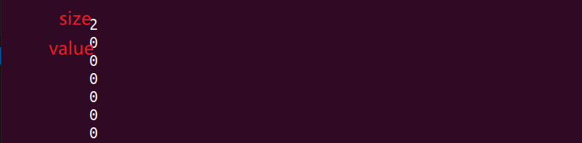

##### 1.2.2.2 复制与比较

数组复制与比较

数组可以用数组名直接复制，也可以用数组名来进行等于和不等于的比较，不适用数值运算。

```verilog
    initial begin
        bit [31:0] array1[5] = {1,2,3,4,5};
        bit [31:0] array2[5] = {2,3,4,5,1};

        if(array1 != array2) begin
            $display("%p != %p",array1,array2);
        end
        array1 = array2;
        $display("%p == %p",array1,array2);
    end
```

数组比较和赋值的结果如下
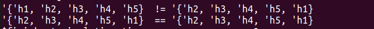

##### 1.2.3 合并数组

合并数组可以作为1个整体来访问，也可以作为数组。例如1个32bit的寄存器，可以看作4个8bit数据，也可以看作单个无符号数。

它的存放方式是连续的bit合集，中间没有没用的空间，另外，合并数组赋值时，高比特放在高索引位置。

```verilog
// 合并数组声明方式
        bit [3:0] [7:0] bytes[4];
        bytes[0] = 32'habcd_abcd;
        bytes[1] = 32'hdecb_dada;
        bytes[2] = 32'haaaa_dada;
        bytes[3] = 32'hbbbb_dada;
        foreach(bytes[i]) begin
            //$displayh(bytes[i],
            //            bytes[i][3],
            //            bytes[i][3][7]);
            // 第二种使用,, 来传入默认参数
            $displayh(bytes[i],,
                        bytes[i][3],,
                        bytes[i][3][7]);
        end
```

执行结果如下
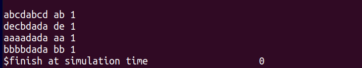

还可以使用合并数组，来实现合并数组的等待触发，使用方法如下

```verilog
    bit [3:0][7:0] array[3]

    //
    forever begin
        // 当数组array[0]的值发生变化，再执行下一步操作
        @array[0]
        // 操作
        ...
        //
    end
```

##### 1.2.4 动态数组

为了避免定长数组所造成的空间浪费，system verilog提供了动态数组，在仿真进行时，为其分配空间或者调整空间。

动态数组在使用前，必须调用new[]操作符来分配空间，也可以把数组传递给new[]操作符，实现数组值的复制。

```verilog
    // 动态数组声明
    int darray1[],darray2[];
    int sarray[5];

    initial begin
        // 创建长度为5的动态数组
        darray1 = new[5];
        foreach (darray1[i]) begin
            std::randomize(darray1[i]);
        end
        $display("%p",darray1);
        $display("%p\n",darray2);

        // 动态数组赋值
        darray2 = darray1;
        $display("%p",darray1);
        $display("%p\n",darray2);

        // 动态数组删除
        darray2.delete();
        $display("%p",darray1);
        $display("%p\n",darray2);

        // 动态数组创建赋值
        darray2 = new[20](darray1);
        $display("%p",darray1);
        $display("%p\n",darray2);

        // 动态数组与定长数组赋值
        sarray = darray1;
        $display("%p",darray1);
        $display("%p\n",sarray);
    end

    
```

运行结果
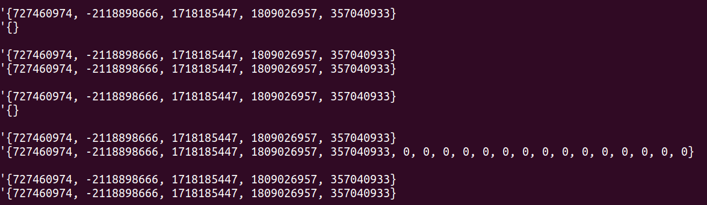

##### 1.2.5 队列

队列可以在任何一个位置增删元素，也可以使用索引访问。当增加的元素超过了原来的队列尺寸，system verilog会分配更多的空间。队列、动态数组、定宽数组之间还可以相互赋值，但是赋值时的数组大小应一致。

```verilog
    // 定义队列
    int q1[$],q2[$] = {1,2,3,4,5};
    initial begin
        // 在0索引位置插入一个元素
        q1.insert(0,2);
        $display("%p",q1);
        // 删除0这个位置的元素
        q1.delete(0);
        $display("%p",q1);


        q2.push_front(1);
        q2.pop_back();

        q2.push_back(8);
        q2.pop_front();

        foreach(q2[i]) begin
            $display(q2[i]);
        end

        // 使用索引范围，$代表最开始的索引或最后的索引
        q2 = {q2[1:$],q2[$:3]};
        $display(q2);

        // 队列给数组赋值
        sarray = q2;
        $display(sarray);

        // 删除队列
        q2 = {};
        q2.delete();
        $display(q2);

    end
```

运行结果如下

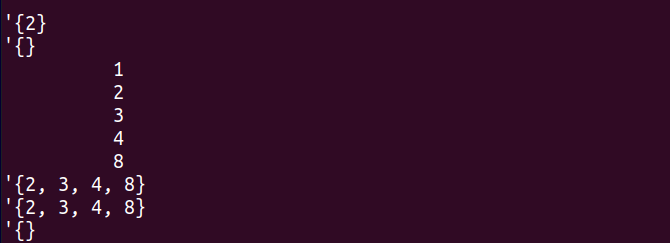

##### 1.2.6 关联数组

system verilog提供了关联数组，来实现稀疏存储，建立高效的查找映射关系。

关联数组的定义使用在中括号里放置数据类型的形式来声明，例如[int]、[packet]，也可以使用[*]不明确类型的方式来声明，不用使用new方法来创建空间。

```verilog
    initial begin
        // 声明索引是string类型的关联数组
        int switch[string],min_address,max_address;
        string index;
        switch["min_address"] = 10;

        switch["max_address"] = 100;

        $display(switch.exists("min_address"));

        // foreach遍历关联数组
        foreach(switch[i]) begin
            $display(switch[i]);
        end

        // 在不知道索引有哪些时，可以通过first、next、last、prev方法来获取
        switch.first(index);
        $display(index);

        switch.next(index);
        $display(index);

        switch.last(index);
        $display(index);

        switch.prev(index);
        $display(index);

    end


```

执行结果如下

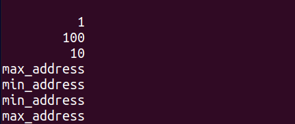

##### 1.2.7 数组的常用方法

这里的数组包括了定长数组、动态数组、队列和关联数组。

###### 数组缩减方法

支持数组中各个元素相互求和（sum）、积（product）、与（and）、或（or）和异或（xor），with方法可以使用默认的重复参数item或者其余的重复参数，比如x，代表了数组中一个元素，使用前需要在方法的参数列表里声明一下。

```verilog
initial begin
        bit [3:0] one_bit[10];
        int  sum;
        int  product;
        
        foreach (one_bit[i]) begin
            one_bit[i] = i+1;
        end
        
        $display(one_bit);
        $display("one_bit.sum = %h",one_bit.sum());
        $display("one_bit.product = %h",one_bit.product());
        $display("one_bit.and = %h",one_bit.and());
        $display("one_bit.or = %h",one_bit.or());
        $display("one_bit.xor = %h",one_bit.xor());

        sum = one_bit.sum();
        $display("one_bit's sum = %h",sum);
        product = one_bit.product();
        $display("one_bit's product = %h",product);

        // 使用with方法，item是默认的，x需要在方法的参数列表里提前声明
        $display("one_bit.sum = %h",one_bit.sum(x) with (int '(x)));
        $display("one_bit.product = %h",one_bit.product() with (int '(item)));
end
```

执行结果如下

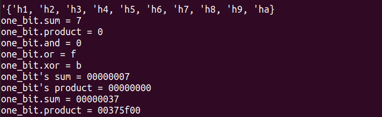

##### 1.2.8 数组定位方法

查找数组的最大值，最小值可以使用max和min方法。去掉数组中重复的元素可以使用方法unique。find方法联合with表达式可以满足条件的元素。以上三个方法的返回值均是队列。

```verilog
initial begin
    int sarray[6]   =   '{1,6,2,6,8,6};
    int darray[]         =   '{2,4,6,8,10};
    int queue[$]        =   {1,3,5,7,3};
    
    $display("sarray.max = %p",sarray.max());
    $display("darray.min = %p",darray.min());
    $display("queue.unique = %p",queue.unique());
end
```

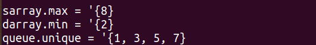

从一系列数组元素中，查找符合条件的元素，往往使用find...with...语法，

```verilog
    int d[$]            =   {9,1,8,3,4,4};
    int tq[$];
    $display("d = ",d);
    // 查找大于3的所有元素
    tq                  =   d.find with (item > 3);
    $display("d > 3 elem = %p",tq);
    // 查找大于3的元素的第一个元素
    tq                  =   d.find_first with (item > 3);
    $display("d > 3 first elem = %p",tq);
    // 查找大于3的元素的第一个索引
    tq                  =   d.find_first_index with (item > 3);
    $display("d > 3 first index = %p",tq);
    // 查找大于3的元素的最后一个元素
    tq                  =   d.find_last with (item > 3);
    $display("d > 3 last elem = %p",tq);
    // 查找大于3的元素的最后一个索引
    tq                  =   d.find_last_index with (item > 3);
    $display("d > 3 last index = %p",tq);
```

执行结果如下
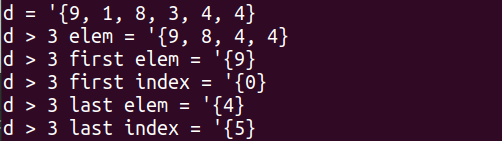

除了以上的查找方法外，还可以用sum...with...来对满足条件的元素求和。这里的item < 7会引入未知的返回值，建议在统计元素个数的时候，明确条件的返回值。

```verilog

        int count,total,d[] =   '{9,1,8,3,4};
        // 统计元素值大于7的个数
        count   =   d.sum with(item < 7 ? 1 : 0);
        $display("d's elem > 7 count = %0d",count);
        // 计算元素值大于7的元素和
        total   =   d.sum with((item > 7)*item);
        $display("d's elem > 7 sum = %0d",total);
        total   =   d.sum with((item > 7) ? item : 0);
        $display("d's elem > 7 sum = %0d",total);
```

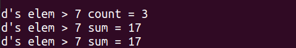

##### 1.2.9 对数组排序

对数组排序，分为正向排序sort（从小到大），逆向排序rsort，倒换位置reverse和打乱顺序shuffle

```verilog
    initial begin
        int d[] =   '{9,1,8,3,4};
        $display("d = %p",d);
        d.reverse();
        $display("d.reverse = %p",d);
        d.sort();
        $display("d.sort = %p",d);
        d.rsort();
        $display("d.rsort = %p",d);
        d.shuffle();
        $display("d.shuffle = %p",d);
    end
```

执行结果如下
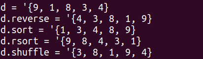

也可以对结构体，按照结构体中某一成员或者多个成员使用sort...with进行排序，在依据多个成员进行排序时，需要使用{}来包括排序所使用的元素。

```verilog
    struct packed {byte red,green,blue;} c[];
    initial begin
        c = new[3];
        foreach(c[i])begin
            c[i] = $urandom(); 
        end
        $display("c = %p",c);
        // 按照red成员排序
        c.sort with(item.red);
        $display("c.sort = %p",c);
        c.sort(x) with({x.green,x.blue});
        $display("c.sort = %p",c);
    end
```

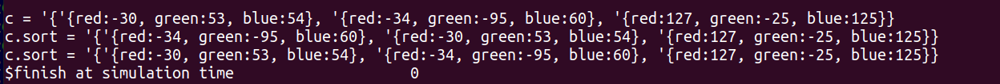

### 1.3 typedef创建新的类型

在verilog使用`define可以创建个一个新的宏，用来文本替换，parameter来定义参数。
在system verilog中新增了typedef，用来定义新的数据类型。
define、parameter、typedef既可以放在程序的外部，又可以放在begin...end块内部。

```verilog
    parameter OPSIZE    =   8;
    parameter ASIZE     =   8;
    typedef bit [OPSIZE-1:0]    char;
    // 新定义的char类型 用来定义数组
    typedef char array[ASIZE];             
    initial begin
        array a;
        foreach(a[i])begin
            std::randomize(a[i]);
        end
        $display(a);
    end
```

#### 1.3.1 结构体struct

struct是一个数据的集合，它是可综合的，并且可以通过模块端口进行传递。
合并的结构会把数据连续的存放起来，中间没有空闲位置。

```verilog
    typedef struct {int a;
            byte b;
            shortint c;
            } my_struct_s;
    my_struct_s st = '{32'haaaa_bbbb,8'hcc,16'hdddd_eeee};
    $display(st);
    $display("str = %x %x %x",st.a,st.b,st.c);
```

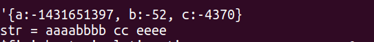

声明结构体为合并类型，可以看到打印整个结构体的结果变成了一个连续的值。

```verilog
    typedef struct packed {int a;
            byte b;
            shortint c;
            } my_struct_s;
    my_struct_s st = '{32'haaaa_bbbb,8'hcc,16'hdddd_eeee};
    $display(st);
    $display("str = %x %x %x",st.a,st.b,st.c);
```

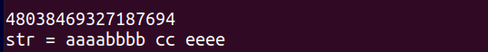

#### 1.3.2 联合

同一个地址空间存储的内容，可以以不同的类型表示。vcs仿真器不支持unpacked类型的union。
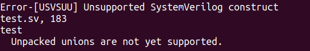

| 特性 | 打包联合 | 非打包联合 |
|------|----------|------------|
| 内存布局 | 确定位宽 | 实现定义 |
| 可综合 | 是 | 通常不可 |
| 数据类型 | 必须相同位宽 | 任意类型 |
| 内存共享 | 精确位对齐 | 可能填充 |

```verilog
program test;
    typedef union packed {
        int number;        // 整数形式
        logic [31:0] bits; // 位形式
    } converter_t;
    initial begin
        converter_t data;
        // 当作整数使用
        data.number = 123;      // 存入整数123
        $display("%d", data.number); // 输出: 123
        
        // 同样的数据，当作位模式使用  
        $display("%h", data.bits);   // 输出: 0000007B (123的十六进制)
    end
endprogram
```

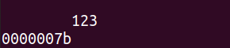

### 1.4 类型转换

#### 1.4.1 静态类型转换

静态类型转换不对转换值进行检查，在转换目标类型时，在要转换的表达式前加上单引号，完成类型转换，不做检查，可能会导致出现数组越级的情况。

静态类型转换还带有一定的四舍五入，比如10.0-0.1的int类型转换结果为10。

```verilog
    int i;
    real j;
    initial begin
        i = int '(10.0-0.1);
        $display("%d\n", i);  
        i = int '(10.0-0.6);
        j = real '(i);
        $display("%d\n", i);   
        $display("%f\n", j);   
    end
```

执行结果如下

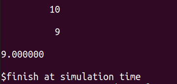

#### 1.4.2流操作符

流操作符是一种打包和解包的工具，用于在不同数据之间进行转换（包括数组和结构体）。基本格式如下，{}是不可少的，slice_size为切片大小，可以有bit、byte、shortint、int、longint这五种选项，对应1bit、8bit、16bit、32bit和64bit，>>代表从左到右流，<<代表从右向左的流。

```systemverilog
    { >> / << [slice_size] {data}}
```

\>>流操作符，代表正常处理数组，<<代表倒序处理。~~对于合并数组和非合并数组之间的转换，非合并数组的默认索引是[0:size-1]，会导致乱序，使用vcs仿真过程中没有出现倒序的现象。~~

```verilog
    initial begin
        bit [63:0]  queue[$];
        bit [3:0]   array[];
        bit [15:0] [7:0] packed_array;
        bit [7:0] array_reverse[16];
        bit [7:0] array_reverse_1[0:15];

        array = new[32];
        foreach(array[i]) begin
            std::randomize(array[i]);
        end
        $display(array);
        // 从左往右
        queue = {>> bit [3:0] {array}};
        $display(queue);
        // 从右往左
        queue = {<< bit [3:0] {array}};
        $display(queue);
        
        // 压缩数组要注意声明的维度
        packed_array    = {>> bit [3:0] {array}};
        $display("%h",packed_array);
        
        array_reverse    = {>> bit [3:0] {array}};
        $display(array_reverse);

        array_reverse_1    = {>> bit [3:0] {array_reverse}};
        $display(array_reverse_1);
    end

```


### 1.5 枚举类型

枚举类型的使用方法通常是，先定义枚举类型，再创建相应的变量。此外，还可以使用内部的name函数，获取变量值的字符串名字。

```verilog
    typedef enum {INIT=1,DECODE=10,IDLE} fsmstate_e;
    fsmstate_e pstate,nstate;
    initial begin
        case(pstate)
            IDLE:nstate = INIT;
            INIT:nstate = DECODE;
            default: nstate = IDLE;
        endcase
        $display("Next state is %s, it's value = %d",nstate.name(),nstate);
        // 赋值无效值，导致赋值失败
        $cast(pstate,0);
        $display("Next state is %s, it's value = %d",pstate.name(),pstate);
    end
```

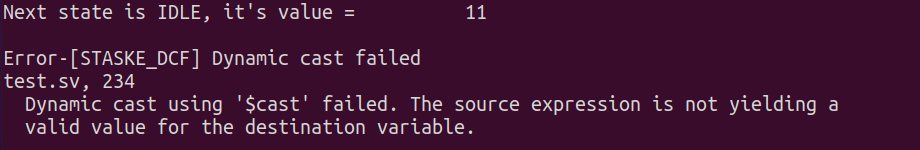

### 1.6 常量

声明常量的方法很简单，在声明时，使用const修饰符修饰，并在声明时进行初始化，在代码中不能改变它的值，改变会报错。

```verilog
    initial begin
        const byte colon = ":";
        $display(colon);
        // 修改const内容会报错
        colon = "h";
    end
```

### 1.7 字符串

字符串使用string来定义，格式化通过$psprintf()来返回新的字符串类型。

### 表达式的位宽

有三种方式，可以指定表达式计算时的宽度，有三种方法。

```verilog
    initial begin
        bit one = 1'b1;
        bit [7:0] byte8;
        $display("%d",one + one);
        // 指定期望的宽度
        byte8 = one + one;
        $display("%d",byte8);
        // 加入其他值来获取期望宽度
        $display("%d",one+one+2'b0);
        // 变量宽度强制转换
        $display("%d",one+2'(one));
    end
```

## 2 过程语句和子程序

### 2.1 任务、函数以及void函数

在system verilog中，允许函数在fork...join_none语句生成的线程中调用task，其余情况均不允许函数调用task。
此外，在verilog中，要求函数必须有返回值，并且返回值必须被使用，在system verilog中，提供了一个忽略它的返回值的方法。参数的默认类型和方向是logic input，但最好还是都带上类型和方向。

```verilog
    // 忽略函数返回值
    void ' ($func(xxx,xxx,xxx));

    // task定义
    task T3(a,b,output bit [15:0] u,v);
```

### 2.2 高级的参数类型 ref

system verilog中，参数的传递方式还有ref类型，它可以传递数组给子程序，以减小堆栈区的使用。

ref参数只能用在带自动存储的task和function里。

program和module本身是static，需要声明成automatic。program和module要想使用automatic，需要在定义的时候声明是automatic或者在task和function定义时，声明成automatic。

任务和函数还支持返回return，十分适用在task发现错误，需要提前返回。

如果任务task的定义时是ref类型的参数，在task里修改变量，修改的结果对其余function和task是实时可见的。

```verilog
    // ref类型 传入的参数
    task bus_read(  input   logic   [31:0]  addr,
                    ref     logic   [31:0]  data);
        bus.request =   1'b1;
        @(posedge bus.grant) 
        bus.addr    =   addr;
        @(posedge bus.enable);
        data        =   bus.data;
        bus.request =   1'b0;
        @(negedge bus.grant);
    endtask

    logic   [31:0]  addr,data;
    initial begin
        fork
            // 并行执行
            bus_read(addr,data);
            thread2:begin
                // 等待data发生变化时
                @data;
                $display("Read %h form bus",data);
            end
        join
    end
```

### 2.3 从函数中返回一个数组

system verilog无法做到直接返回数组，可以通过typedef一个数组类型来返回数组。

还可以通过

```verilog
    // 定义数组类型
    typedef int fixed_array5[5];
    fixed_array5 f5;

    // 通过函数返回值方式，返回typedef定义的数组类型
    function fixed_array5 init(int start);
    //function int [5] init(int start);
        foreach(init[i]) begin
            init[i] =   i   +   start;
        end
    endfunction
    initial begin
        f5 = init(5);
        foreach(f5[i]) begin
            $display("f5[%0d]   =   %0d",i,f5[i]);
        end
    end

    // 使用ref修改数组
    function void init(ref int f[5],input int start);
        foreach (f[i])
            f[i]    =   i   +   start;
    endfunction
    
    initial begin
        init(f5,5);
        foreach(f5[i]) begin
            $display("f5[%0d]   =   %0d",i,f5[i]);
        end
    end
```

### 2.4 局部数据存储

在verilog和systemverilog里的task和function里的传入和传出变量以及内部变量，默认是存储在静态存储区的，也就是说，变量是静态变量，多次调用使用的是同一个地址空间的变量。

下面task在第二次调用会覆盖第一次调用传入的addr、expect_data以及输出的success。原因在于task里的变量使用的是同一个地址。将program声明为automatic就能解决这个问题。

```verilog
    program test;
        task wait_for_mem(input [31:0] addr,expect_data,output access);
            while(bus.addr != addr)
                @(bus.addr);
            success = (bus.data == expect_data);
        endtask
    endprogram
```

### 2.5 时间打印

system verilog允许使用0.1ns和20ps这样单位的延时，还支持使用\$timeformat,\$time和\$raaltime。并且支持把时间值存到变量里，在计算和延时中使用它们。
\$time和\$realtime分别返回整形和real型时间值。
\$timeformat设置\%t打印格式。

```verilog
    initial begin
        real rdelay = 80ns;
        time tdelay = 90us;
        $timeformat(-9,3,"ns",8);
        # rdelay;
        $display("%t",$realtime);
        # tdelay;
        $display("%t",$time);
    end
```

## 3 连接设计与测试平台

### 3.1 一般的interface用法

使用接口连接dut和测试平台，首先定义接口interface，时钟clk可以是接口的一部分，也可以不是。

此外，接口信号还必须是能非阻塞赋值来驱动。

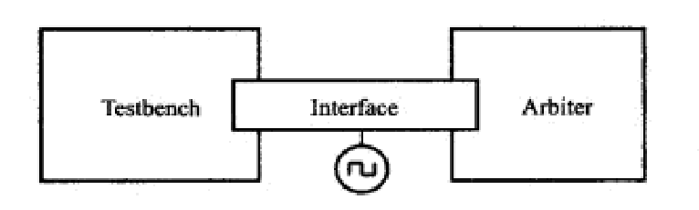

interface定义如下

```verilog
interface arb_if(input bit clk);
    logic [1:0] grant,request;
    logic       rst;
endinterface
```

使用interface连接dut和测试平台

```verilog
module top;
    bit clk;
    always #5 clk =~clk;
    // 声明interface
    arb_if  arbif(clk);
    arb a1  (arbif);
    test t1 (arbif);
endmodule
```

### 3.2 使用modport对信号分组

上面使用方法是无信号方向的连接，使用modport为信号定义方向。

```verilog
interface arb_if(input bit clk);
    logic [1:0] grant,request;
    logic       rst;
    //
    modport TEST(   output  request,rst,
                    input   grant,clk);
    
    modport DUT(    input   request,rst,clk
                    output  grant);
endinterface
```

```verilog
// 在信号列表用interface的顶层来创建声明
module  test(arb_if.TEST arbif);
    always @(posedge arbif.request)begin
    // 做些什么
    end
endmodule
```

### 3.3 时钟块

接口的时钟块里的任何信号都会被同步地驱动或采样。

时钟块在看书的时候总是很迷惑，感觉书上讲的很不清晰，这里花较多篇幅详细介绍一下。

时钟块里的信号，DUT输出到testbench的输入有一个延时，从testbench的输出到DUT的输入没有延时，总结下来就是如下代码。

```verilog
    default input #1 step output #0;
```

input skew和output skew，用来控制时序。input skew表示在时钟有效边沿采样信号的偏斜单位时间，output skew表示在时钟有效边沿驱动信号的偏斜单位时间，下图中定义的input skew就是相对于时钟沿多少单位时间采样，output skews是向后延多少单位时间输出。

```verilog
    clocking xxx @(clk)
        input   #1ps    in1;
        output  #6ps    out1;
    endclocking
```

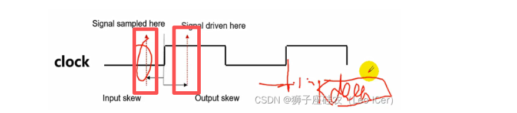

时钟块的默认时序是在#1step，采样输入信号，在#0延时后，驱动输出信号。1step是一个时间点，代表前一个时间片的postponed区域。
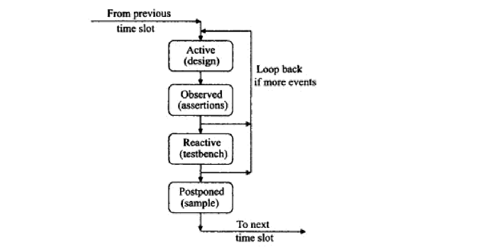

### 3.4 程序program块

program块不可以被其余program或者module例化，但是program内不能例化module。

```verilog
// 接口
interface bus_if(input bit clk);
    logic [3:0] data;
endinterface

// 设计
module dut(input clk, input [3:0] data);
    always @(posedge clk) begin
        $display("DUT: data = %0d", data);
    end
endmodule

// 测试program
program test(bus_if ifc);
    initial begin
        for (int i = 0; i < 5; i++) begin
            @(posedge ifc.clk);
            ifc.data <= i;
        end
        #100 $finish();
    end
endprogram

// 顶层模块
module top;
    bit clk;
    initial begin
        clk = 0;
        forever #10 clk = ~clk;
    end
    
    bus_if ifc(clk);
    dut u_dut(.clk(ifc.clk), .data(ifc.data));
    test u_test(ifc);
endmodule
```

### 3.5 仿真的结束

在systemverilog中，所有程序块的initial块中最后一个语句执行完毕后，编译器就认为这是测试的结尾，会停止程序，也可以通过调用\$exit或者\$finish结束测试。

