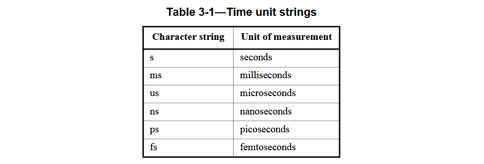

# 学习system verilog标准手册--IEEE Std 1800-2009

## 1 基本构成元素

### 1.1 module

SystemVerilog中的基本块是模块，包含在关键字**module**和**endmodule**之间。模块主要用于表示设计块，但也可以用作验证代码以及验证块和设计块之间的互连的容器。模块可以包含的一些构造包括以下内容：

- 端口：带有端口声明
- 数据声明，如网络、变量、结构和联合
- 常量声明
- 用户定义的类型定义
- 类定义
- 从包中导入声明
- 子例程定义
- 其他模块、接口、程序、接口、检查器和原语的实例化
- 类对象的实例化
- 连续赋值
- 程序块
- 生成块
- 指定块

```verilog
module mux2to1 (input wire a, b, sel, // combined port and type declaration
output logic y);
    always_comb begin // procedural block
        if (sel) 
            y = a; // procedural statement
        else 
        y = b;
    end
endmodule: mux2to1 
```

### 1.2 program

program块包含在关键字**program**和**endprogram**之间，用于对测试台环境进行建模。module构造适用于硬件描述。然而，对于testbench，重点不是硬件级别的细节，如布线、结构层次和互连，而是对验证设计的完整环境进行建模。
program块有以下三个作用：

- 提供了一个执行testbench的入口点。
- 创建了一个范围，用于封装program范围的数据、任务和函数。
- 提供了一个范围来指定Reactive（仿真调度的特定区域）区域中的调度。

program作为设计和testbench之间的一个明确的分界线，它规定了专门的仿真执行的相关内容。与时钟块（clocking）一起，提供了设计和testbench之间的无竞争冒险，并实现了周期和事务级的抽象。

program可以包含数据声明、类定义、子例程定义、对象实例以及一个或多个initial或final过程。它不能包含always块、原语实例、module、interface或其他program实例。

SystemVerilog的抽象和建模结构简化了测试台的创建和维护。每个program块通过实例化和之间的连接使它们能够作为通用模型使用。

```verilog
program test (input clk, input [16:1] addr, inout [7:0] data); 
    initial begin 
    ...      
endprogram
```

### 1.3 interface

interface由**interface…endinterface**关键字界定，封装了设计模块之间以及设计与验证模块间的通信接口协议，是一种经过命名的网络或变量集合体。

interface可在设计中实例化，并能够与其他实例化的module、接口interface以及程序program的接口里的端口进行互连。以前的design中往往存在大量由重复命名构成的端口声明与连接列表，通过采用这种分组命名的interface机制，能够显著缩减设计描述的代码规模，同时提升系统的可维护性。

接口interface支持参数化配置，可包含常量、变量、函数及任务等成员元素，其数据类型既可在内部显式声明，亦可作为参数动态传入。成员变量和函数的访问须通过接口实例名进行限定引用。通过此机制，通过interface连接的模块可直接调用接口实例的成员子程序实现通信驱动。

这种将功能逻辑封装于接口内部并与模块解耦的设计范式，使得通信协议的抽象层级或粒度调整仅需替换具有相同成员签名但实现方式不同的接口实例即可完成，而关联模块完全无需任何修改。这种设计显著提升了系统架构的可扩展性与协议升级的灵活性。

为规范module的端口的信号方向性并管控在特定module中的使用接口中的子程序，标准定义了modport构造机制。modport的方向属性始终以包含该接口实例的模块的视角进行定义。

除子程序外，接口还可内嵌进程结构（如initial或always过程块）及连续赋值assign语句，这对系统级建模与测试平台构建具有重要价值。通过该特性，接口可集成自有的协议验证机制，自动校验所有经由该接口连接的模块是否符合既定协议规范。此外，诸如功能覆盖率采集与分析、协议合规性检查及断言验证等高级应用亦可直接嵌入接口实现。

```verilog
interface simple_bus(input logic clk); // 接口interface定义
    logic req, gnt; 
    logic [7:0] addr, data; 
    logic [1:0] mode; 
    logic start, rdy;  
endinterface: simple_bus  
module memMod(simple_bus a); // 当memMod模块在top层实例化时，a.req代表’simple_bus’接口实例sb_intf内的req信号
    always @(posedge clk) a.gnt <= a.req & avail; 
endmodule  
module cpuMod(simple_bus b); // 传入接口
    ...  
endmodule 
module top; 
    logic clk = 0;  
    simple_bus sb_intf(.clk(clk)); // 实例化interface  
    memMod mem(.a(sb_intf)); // 把interface连接到mem模块 
    cpuMod cpu(.b(sb_intf)); // 把interface连接到cpu模块
endmodule
```

### 1.4 checker

验证器(checker)结构由关键字**checker...endchecker**定义，是一种封装了断言和建模代码的验证功能模块。该结构的主要用途包括：(1)作为验证库的基础功能单元；(2)构建形式化验证所需的抽象辅助模型组件。

### 1.5 primitive

源语模块用于表示底层逻辑门和开关元件。SystemVerilog提供了若干内置的原语类型。设计人员可通过用户自定义原语(User Defined Primitives，UDP)对内置原语进行扩展，其语法结构由关键字**primitive...endprimitive**界定。内置原语与用户自定义原语结构支持建立时序精确的数字电路模型，该类建模通常称为门级建模。

### 1.6 子程序subroutine

**子程序**提供了一种封装可执行代码的机制，可在多处调用。子程序分为两种形式：**任务task**和**函数function**。  
**任务**以语句形式调用，可包含任意数量的输入（input）、输出（output）、双向（inout）及引用（ref）参数，但不返回值。任务执行时可阻塞仿真时间，即任务结束时可能处于比调用时刻更晚的仿真时间点。  
**函数**可返回值，亦可定义为**无返回值函数（void function）**。有返回值函数可以在表达式中作为操作数使用，而无返回值函数则以语句形式调用。函数可包含输入、输出、双向及引用参数，但必须在不阻塞仿真时间；不过，函数可以派生出能阻塞时间的子进程。

### 1.7 包package

模块（modules）、接口（interfaces）、程序块（programs）和验证器（checkers）为其内部声明提供了局部命名空间。在这些结构中声明的标识符仅在其作用域内有效，不会影响或与其他构建块的声明产生冲突。
包（packages）提供了可被其他模块、接口等构件共享的声明空间，其声明内容可通过导入机制引入其他构建块（包括其他包）。

package关键字用于定义一个包，其语法以package开始、endpackage结束。

```verilog
package ComplexPkg; 
    typedef struct {  
        shortreal i, r; 
    } Complex;  
    function Complex add(Complex a, b); 
        add.r = a.r + b.r; 
        add.i = a.i + b.i; 
    endfunction  
    function Complex mul(Complex a, b); 
        mul.r = (a.r * b.r) - (a.i * b.i); 
        mul.i = (a.r * b.i) + (a.i * b.r); 
    endfunction 
endpackage : ComplexPkg
```

### 1.7 配置

SystemVerilog提供了定义设计配置功能，该功能用于说明模块实例与特定SystemVerilog源代码之间的绑定关系。配置机制的实现依赖于库（library）系统。一个库是由模块（module）、接口（interface）、程序（program）、检查器（checker）、原语（primitive）、包（package）及其他配置（configure）构成的集合。通过独立的库映射文件（library map file）可精确指定各库中模块单元对应的源代码位置。在仿真器或其他需要解析SystemVerilog源代码的软件工具的启动时，此类库映射文件的命名规范通常作为调用选项。

### 1.8 以上结构的层次架构

模块可实例化其他模块、程序、接口、检查器及原语，从而形成层次化树状结构。接口同样能实例化其他基础构件以构建层次树。程序与检查器可实例化其他检查器。原语作为层次树的终端节点，不具备实例化其他构件的能力。

一个没有被任何其他模块“实例化”的模块，会被编译器自动创建一次，成为一个独立的、顶层的“单元”。并且system verilog一个设计中允许存在多个这样的顶层单元。

### 1.9 编译和细化

编译（compliation）是指读入SystemVerilog源代码、解密加密的代码并对源代码进行语法与语义分析的过程。实现（implementation）可采用单趟或多趟扫描方式执行编译，将编译结果存储为专有中间格式，亦可直接传递至细化阶段。须注意，并非所有语法和语义检查都能在编译过程中完成，部分检查仅可在细化（elaboration）期间或完成后执行。system verilog由于编译单元机制，可以支持单文件与多文件编译。

细化是将构成设计之各组件进行绑定的过程，这些组件包括模块实例、程序实例、接口实例、检查器实例、原语实例以及设计层次结构的顶层。细化在源代码解析之后、仿真之前，具体过程包含：展开实例化、计算参数值、解析层次化名称、建立线网wire连接性，以及为仿真进行设计准备工作。

编译、细化、实现这三个阶段不是相互独立的步骤。通常编译是指其与细化的合并过程。

### 1.10 编译单元

system verilog使用编译单元实现分离编译。

- 编译单元是指一起编译的一个或多个SystemVerilog源文件集合。

- 编译单元作用域（compilation-unit scope）：一种隶属于编译单元的局部作用域，其包含所有不在其他作用域内的声明项。

- $unit：用于显式访问编译单元作用域内标识符的专用名称。

构成编译单元的具体文件集合取决于工具的实现，但是工具应提供满足以下两种用例的使用模型：a) 通过编译命令行指定的所有文件构成单一编译单元（此时这些在整个文件集合的文件里的声明项遵循标准可见性规则）；b) 每个文件作为独立编译单元（此时各编译单元作用域内的声明项仅在其对应文件内部可见）。
通过`include指令包含的文件内容将成为include所属的文件的编译单元的一部分。

如果直到某文件末尾仍然存在未完成的声明项，则包含该文件的编译单元将自动延伸至后续文件，直到这组文件中不再存在未完成声明。其他文件到编译单元的映射方式可能存在，但其定义机制具有工具特定性且可能不具备可移植性。

以下元素在所有编译单元中均可见：模块(module)、原语(primitive)、程序(program)、接口(interface)和包(package)。但编译单元作用域内定义的项无法通过名称从外部直接访问，仅能通过PLI接口提供的迭代器遍历访问。

编译单元作用域中的定义项，可以采用层次化方式引用标识符。在执行向上名称引用时，编译单元作用域被视为顶层设计单元。这意味着，若引用的标识符既非编译单元作用域内创建，或者通过将包导入编译单元作用域，那么这个引用将被作为设计顶层（即$root）开始的完整路径名。

在编译单元内部，编译器指令对所有的所属的源代码文本生效。然而，来自一个独立编译单元的编译器指令不会影响其他编译单元。此特性可能导致分独立编译单元和单一编译单元两种编译方式产生行为差异。

$unit是界定编译单元的作用域命名，用于确定对编译单元最外层声明的引用。简单来说就是模块、程序、接口外的定义项。使用调用包内定义项时使用的相同作用域解析运算符::实现。

```verilog
bit b; 
task t; 
    int b;  
    b = 5 + $unit::b; // $unit::b是外部的变量b 
endtask
```

除任务及函数名称外，所有引用必须指向编译单元中已预先定义的标识符。显式使用"$unit::"前缀仅用于命名消歧义，并不具备引用后续编译单元的定义项的能力。

### 1.11 命令空间

SystemVerilog为标识符定义了八个命名空间：其中两个是全局命名空间（定义命名空间和包命名空间），两个是编译单元全局命名空间（编译单元命名空间和文本宏命名空间），四个为局部命名空间。

- 定义命名空间统合了所有外层声明之外定义的非嵌套模块（module）、原语（primitive）、程序（program）和接口（interface）标识符。当某一编译单元中使用某名称定义了上述元素后，该名称禁止在任何编译单元中重复用于声明其他外层声明之外的非嵌套模块、原语、程序或接口。

- 包命名空间统合了所有编译单元中定义的包标识符。当某一编译单元中使用某名称定义了包之后，该名称禁止在任何编译单元中重复声明其他包。

- 编译单元作用域命名空间存在于模块、接口、包、检查器、程序和原语之外。它统合了编译单元作用域内的函数（function）、任务（task）、检查器（checker）、参数（parameter）、命名事件（named event）、线网声明（net declaration）、变量声明（variable declaration）以及用户自定义类型的定义。

- 文本宏命名空间在编译单元内具有全局作用域。由于文本宏名称通过前导单引号字符（`）引入和引用，因此与其他任何命名空间均保持明确的区分性。宏名称的定义严格遵循构成编译单元的输入文件中的线性出现顺序，当出现同名宏定义时，后续定义将自动覆盖先前定义，该覆盖效果将持续作用于剩余输入文件。

- 模块命名空间由模块(module)、接口(interface)、包(package)、程序(program)、检查器(checker)和原语(primitive)结构引入。该空间统合了封闭结构内的模块、接口、程序、检查器、函数(function)、任务(task)、命名块(named block)、实例名(instance name)、参数(parameter)、命名事件(named event)、线网声明(net declaration)、变量声明(variable declaration)以及用户自定义类型的定义。

- 块级命名空间由命名或未命名块、指定块(specify)、函数(function)和任务(task)结构引入。该空间在封闭结构内统合了命名块、函数、任务、参数、命名事件、变量类型声明(variable type declaration)及用户自定义类型的定义。

- 端口命名空间由模块(module)、接口(interface)、原语(primitive)和程序(program)结构引入，用于结构化定义不同命名空间中两个对象间的连接方式。连接类型可包括单向（输入或输出）或双向（inout或ref）。端口命名空间与模块及块级命名空间存在重叠。本质上，端口命名空间规定了不同命名空间中名称间的连接类型，其声明类型包括input、output、inout和ref。端口命名空间中引入的端口名称可通过声明同名变量或线网，在模块命名空间中重新引入。  
- 属性命名空间由附着于语言元素 ( \* and \* ) 结构界定。属性名称仅能在此空间内定义和使用，其他任何类型的名称均不得在此空间定义。  

在任何命名空间内，对已通过先前声明定义的名称进行重复声明均属非法。

### 1.12 仿真时间单元和精度

仿真的关键要素之一是时间维度。所谓仿真时间指仿真器为建模仿真系统，在真实时间尺度下维护的时间参量。"时间"和"仿真时间"是同等的。时间参量在设计要素中，既用于描述信号传输延迟，也用于描述过程语句执行间的时序间隔。  
时间参量由两个基本维度构成：  
— 时间单位：定义时间及延迟的基准单元，其可配置范围涵盖10²秒至10⁻¹⁵秒（飞秒）量级；  
— 时间精度：确立延迟参量的有效精度。  
时间单位与时间精度的表征均采用标准化的字符串标记法，有如下单位s（秒）、ms（毫秒）、μs（微秒）、ns（纳秒）、ps（皮秒）及fs（飞秒），并支持10ⁿ（n∈{0,1,2}）量级扩展。



某设计元素的时间精度等级不得低于其时间单位量级，其时间精度单位长不得超时间单位量级。

#### 1.12.1 时间单位与精度的指定方式  

时间单位与时间精度可通过两种方式进行声明：  

1. 采用编译器指令\`timescale

2. 使用关键字组合timeunit与timeprecision

#### 1.12.2 `timescale编译单元指令

`timescale`编译器指令用于为后续所有未显式声明`timeunit`和`timeprecision`的设计单元指定默认时间单位与精度。该指令自源代码中出现位置起生效，直至遇到下一条`timescale`指令为止，其作用范围仅限于当前编译单元，不跨编译单元传播。指令的标准语法如下

```verilog
`timescale time_unit / time_precision
```  

示例中，首条指令声明了1ns时间单位与10ps精度（2位小数精度），该设置同时作用于模块A和B；后续第二条指令将设定更新为1ps时间单位与1ps精度（整数精度），该设定专用于模块C。

```verilog
`timescale 1 ns / 10 ps 
module A (...); 
    ...  
endmodule  

module B (...); 
    ...  
endmodule  

`timescale 1ps/1ps 
module C (...); 
    ...  
endmodule
```

`timescale指令可能导致文件顺序依赖性问题。若以上三个模块按A、B、C顺序（如示例所示）编译，模块B将采用纳秒级时间单位进行仿真；若以C、B、A顺序编译相同文件，则模块B将采用皮秒级时间单位。这种差异将导致模块B中设定的时间值产生截然不同的仿真结果。

#### 1.12.3 timeunit和timeprecision关键字

时间单位与精度可分别通过`timeunit`和`timeprecision`关键字进行声明，并设置为时间字面量。此外，时间精度也可通过在`timeunit`关键字后加斜杠分隔符来声明，例如：

``` verilog
module D (...);
    timeunit 100ps;
    timeprecision 10fs;
    ...
endmodule
module E (...);
    timeunit 100ps / 10fs;  // 带可选第二参数的timeunit声明
    ...
endmodule
```

在设计单元内部定义`timeunit`和`timeprecision`结构可消除编译器指令引发的文件顺序依赖性问题。

任何模块（module）、程序（program）、包（package）、接口（interface）定义或编译单元作用域内，至多允许存在一个时间单位和一个时间精度声明，从而形成时间作用域（time scope）。若采用`timeunit`和`timeprecision`声明方式，其必须在该时间作用域内优先于其他所有条目出现。

#### 1.12.4 timeunit、timeprecision 与 `timescale 的优先级规则  

若模块（module）、程序（program）、包（package）或接口（interface）定义中未显式指定时间单位（timeunit），则其时间单位应按照以下优先级规则确定：  

1. 嵌套继承规则：若当前模块或接口定义处于嵌套结构中（注：程序与包不可嵌套），则继承其外层模块或接口的时间单位；  
2. \`timescale 指令优先：若当前编译单元内存在先前声明的 \`timescale 指令，则采用最后一次 `timescale 指令指定的时间单位；  
3. 编译单元作用域规则：若编译单元作用域（位于所有其他声明之外）已通过 timeunit 声明指定时间单位，则采用该时间单位；  
4. 默认规则：若以上条件均未满足，则使用实现相关的默认时间单位。  

- 编译单元作用域的时间单位仅可通过 timeunit 声明设定，不可通过 `timescale 指令指定。若无声明，则使用默认时间单位。  
- 当前时间作用域（time scope）中若未定义时间精度（timeprecision），其确定规则与时间单位优先级一致。  
- 默认时间单位与精度的具体值由仿真工具实现决定。  

#### 1.12.5 仿真时间单位

全局时间精度（亦称为仿真时间单位）由以下各项中的最小值确定：  

1. 设计中所有 `timeprecision` 声明指定的时间精度；

2. 所有 `timeunit` 声明的可选精度参数；  

3. 所有 `timescale` 编译器指令的最小精度参数。  

步骤时间单位等于全局时间精度。与其他表示物理单位的时间单位不同，步骤（step）不可用于设置或修改时间精度或时间单位。

## 2 调度语义
